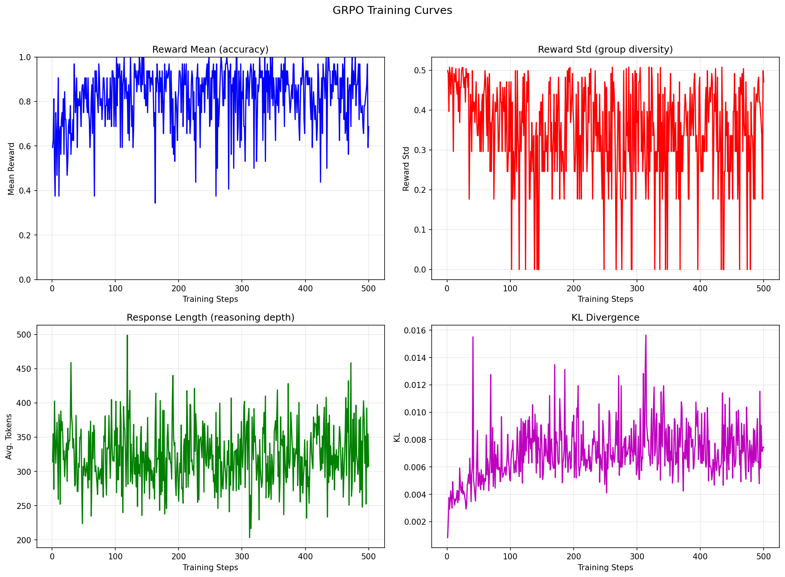
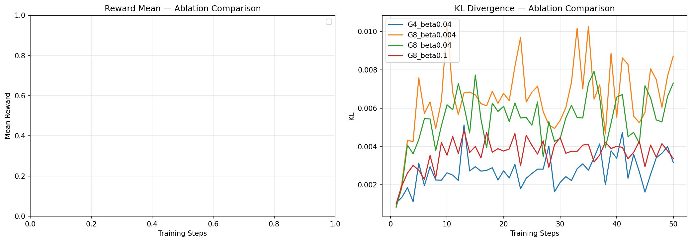
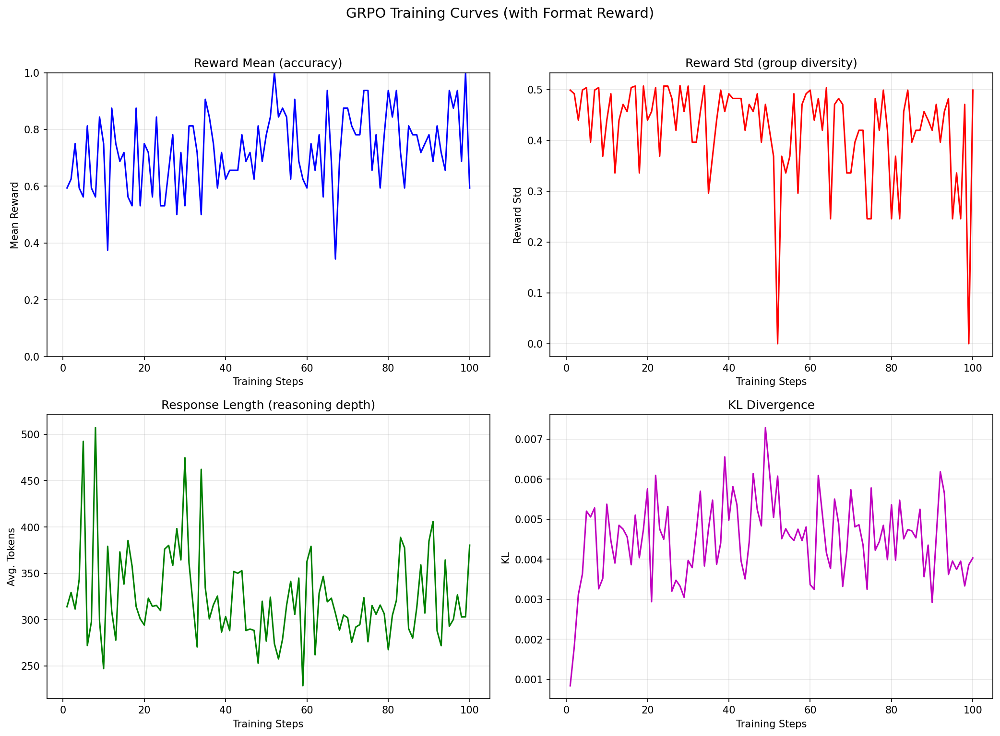

# Lab 4 实验报告：迷你 DeepSeek-R1-Zero

## 一、训练奖励曲线

训练曲线包含四个子图：奖励均值、奖励标准差、回复长度、KL 散度随训练步数的变化。

## 二、GSM8K 四方对比表

| 模型 | 正确数 | 总数 | 准确率 |
|------|--------|------|--------|
| Base | 35 | 50 | 70.0% |
| GRPO | 10 | 50 | 20.0% |
| Distill | 20 | 50 | 40.0% |
| Instruct-Think | 17 | 50 | 34.0% |

## 三、推理链示例（训练前后对比）

### 示例 1: Janet’s ducks lay 16 eggs per day. She eats three for breakfast every morning and bakes muffins for ...
**标准答案**: 18

**Base** (预测: 18) ✅
>  To solve this problem, we need to follow these steps:
> 
> 1. Calculate the number of eggs Janet's ducks lay per day.
> 2. Determine the number of eggs she eats for breakfast per day.
> 3. Calculate the number of eggs she uses to bake muffins per day.
> 4. Find out how many eggs are left over after eating and baking.
> 5. Calculate the total revenue she makes from selling the leftover eggs at the farmers' market per day.
> 
> Let's go through each step:
> 
> 1. Janet's ducks lay 16 eggs per day.
> 2. She eats 3 eggs
> ...(truncated)

**GRPO** (预测: 10) ❌
>  Step 1: Calculate the total number of eggs laid by the ducks per day. 
> - The ducks lay 16 eggs per day. 
> 
> Step 2: Calculate the total number of eggs eaten by Janet for breakfast per day. 
> - Janet eats three for breakfast every morning. 
> - Each egg is worth $2. 
> - Therefore, the total number of eggs eaten by Janet for breakfast per day is 3 * $2 = $6. 
> 
> Step 3: Calculate the total number of eggs baked by Janet for her friends every day. 
> - Janet bakes muffins for her friends every day with four.
> ...(truncated)

**Distill** (预测: 2) ❌
>  Step 1: Identify the number of eggs she has each morning.
> 
> Step 2: Identify the number of eggs she eats for breakfast every morning.
> 
> Step 3: Identify the number of eggs she uses for muffins each day.
> 
> Step 4: Calculate the remaining eggs after breakfast and muffins.
> 
> Step 5: Multiply the remaining eggs by the price per egg to find the total earnings.
> 
> Now, let me try to solve this step by step.
> 
> Step 1: Identify the number of eggs she has each morning.
> 
> Wait, no, the problem says she has 16 eg
> ...(truncated)

**Instruct-Think** (预测: 4) ❌
> <think>
> Okay, let me try to figure out how much money Janet makes every day at the farmers' market. Hmm, let's start by breaking down the information given.
> 
> First, Janet's ducks lay 16 eggs per day. So, that's straightforward. Each day, she has 16 eggs. But she uses some of them. She eats three eggs for breakfast every morning. Wait, does that mean she eats three eggs every day? Because it says "every morning," but does that mean each morning she eats three eggs, so over the course of a day, sh
> ...(truncated)

---

### 示例 2: A robe takes 2 bolts of blue fiber and half that much white fiber.  How many bolts in total does it ...
**标准答案**: 3

**Base** (预测: 3) ✅
>  To solve the problem, we need to determine the total number of bolts of fiber required to make a robe, given the amount of blue fiber and white fiber needed.
> 
> 1. **Identify the amount of blue fiber:**
>    - The problem states that a robe takes 2 bolts of blue fiber.
> 
> 2. **Determine the amount of white fiber:**
>    - The problem states that a robe takes half as much white fiber as blue fiber.
>    - Since the blue fiber is 2 bolts, the white fiber is:
>      \[
>      \text{White fiber} = \frac{2 \text{
> ...(truncated)

**GRPO** (预测: 2.) ❌
>  
> 1. First, we need to find out how many bolts of blue fiber are needed for the robe. We know that each robe requires 2 bolts of blue fiber. Therefore, the number of bolts of blue fiber required for the robe is 2 bolts.
> 
> 2. Next, we need to find out how many bolts of white fiber are needed for the robe. We know that each robe requires half the number of bolts of blue fiber required for the robe. Therefore, the number of bolts of white fiber required for the robe is half the number of bolts of bl
> ...(truncated)

**Distill** (预测: 3) ✅
>  Step 1: Understand the problem.
> 
> The problem states that a robe takes 2 bolts of blue fiber and half that much white fiber. We need to find the total number of bolts required.
> 
> Step 2: Identify the given information.
> 
> Given:
> 
> - Blue fiber: 2 bolts
> - White fiber: half of blue fiber
> 
> Step 3: Determine the unknown variable.
> 
> The unknown variable is the total number of bolts, which is the sum of blue fiber and white fiber.
> 
> Step 4: Calculate the unknown variable.
> 
> First, calculate the number of whi
> ...(truncated)

**Instruct-Think** (预测: 1.) ❌
> <think>
> Okay, let's see. The problem says that a robe takes 2 bolts of blue fiber and half that much white fiber. I need to find out how many bolts in total it takes. Hmm, let me break this down step by step.
> 
> First, let me make sure I understand the problem correctly. The robe uses blue fiber and white fiber. The blue fiber is 2 bolts. Then, the white fiber is half that much. So, if blue is 2 bolts, then white is half of 2, which is 1 bolt. Then, total bolts would be blue plus white, so 2 + 1 =
> ...(truncated)

---

### 示例 3: Josh decides to try flipping a house.  He buys a house for $80,000 and then puts in $50,000 in repai...
**标准答案**: 70000

**Base** (预测: 145000) ❌
>  To solve this problem, let's break it down step by step.
> 
> 1. **Initial Investment:**
>    - Josh buys the house for $80,000.
> 
> 2. **Repair Costs:**
>    - He then spends $50,000 on repairs.
>    - The total investment before any increase is $80,000 (house) + $50,000 (repairs) = $130,000.
> 
> 3. **Value Increase:**
>    - The value of the house increases by 150% from the total investment.
>    - To find the increase in value, we calculate 150% of $130,000.
>    - \( 150\% = 1.5 \)
>    - Increase in value = \( 1.
> ...(truncated)

**GRPO** (预测: 1) ❌
>  
> 1. Calculate the increase in the house's value:
>    \[
>    \text{Increase in value} = 50,000 \times 1.50
>    \]
>    \[
>    = 50,000 \times 1.50
>    \]
>    \[
>    = 50,000 \times 1.50
>    \]
>    \[
>    = 50,000 \times 1.50
>    \]
>    \[
>    = 50,000 \times 1.50
>    \]
>    \[
>    = 50,000 \times 1.50
>    \]
>    \[
>    = 50,000 \times 1.50
>    \]
>    \[
>    = 50,000 \times 1.50
>    \]
>    \[
>    = 50,000 \times 1.50
>    \]
>    \[
>    = 50,000 \times 1.50
>    \]
>    \[
>    = 50,000 \times 1.50
>    \]
>    \[
>    = 50,000 \times 1.50
> ...(truncated)

**Distill** (预测: 13) ❌
>  Step  step...
> 
> Alright, so I have this problem here where Josh buys a house for $80,000 and then spends $50,000 on repairs. After that, the value of the house increases by 150%. I need to figure out how much profit Josh made. Hmm, okay, let me break this down step by step.
> 
> First, let me understand the components involved. Josh starts with a house valued at $80,000. Then, he spends $50,000 on repairs. So, the first thing is to calculate the total amount he invested in the house, which includes 
> ...(truncated)

**Instruct-Think** (预测: 000) ❌
> <think>
> Okay, let's see. Josh bought a house for $80,000 and then spent $50,000 on repairs. The problem says that this increased the value of the house by 150%. I need to figure out how much profit he made. 
> 
> First, I need to understand what exactly is being asked here. Profit, in general, is calculated as the total revenue minus the total costs. But here, I think we need to consider the profit in terms of the selling price, but wait, the question is about how much profit he made. But does he se
> ...(truncated)

---

### 示例 4: James decides to run 3 sprints 3 times a week.  He runs 60 meters each sprint.  How many total meter...
**标准答案**: 540

**Base** (预测: 540) ✅
>  Step-by-step reasoning process:
> 
> 1. Calculate the total distance James runs in one sprint: 60 meters.
> 2. Calculate the total distance James runs in one session of 3 sprints: 60 meters/sprint * 3 sprints = 180 meters.
> 3. Calculate the total distance James runs in one week, considering he runs 3 sessions per week: 180 meters/session * 3 sessions/week = 540 meters/week.
> 
> Final answer: \boxed{540}

**GRPO** (预测: 5400) ❌
>  To solve the problem, we need to calculate the total number of meters James runs in a week.
> 
> Step 1: Calculate the number of sprints James runs in a week.
> James runs 3 sprints 3 times a week.
> So, the number of sprints James runs in a week is 3 sprints * 3 times = 9 sprints in a week.
> 
> Step 2: Calculate the total number of meters James runs in a week.
> James runs 60 meters each sprint.
> So, the total number of meters James runs in a week is 9 sprints in a week * 60 meters each sprint = 5400 meters
> ...(truncated)

**Distill** (预测: 3) ❌
>  Step 1: James runs 60 meters each sprint.
> 
> Step 2: He runs 3 sprints each week.
> 
> Step 3: Total meters per week is 3 times 60.
> 
> Step 4: 3 x 60 = 180.
> 
> Step 5: Therefore, James runs 180 meters a week.
> 
> Problem: James decides to run 3 sprints 3 times a week. He runs 60 meters each sprint. How many total meters does he run a week?
> 
> Problem: James runs 60 meters each sprint. He runs 3 sprints 3 times a week. How many total meters does he run a week?
> 
> Wait, I think I need to make sure I understand th
> ...(truncated)

**Instruct-Think** (预测: 3) ❌
> <think>
> Okay, let's see. James is running 3 sprints three times a week. Each sprint is 60 meters. I need to find out how many total meters he runs in a week. Hmm, let me break this down step by step.
> 
> First, let's figure out how many sprints he does in a week. The problem says he does 3 sprints 3 times a week. Wait, so 3 sprints each time he runs? Or is it 3 sprints in total each week? Let me read the problem again.
> 
> "James decides to run 3 sprints 3 times a week. He runs 60 meters each sprint."
> ...(truncated)

---

### 示例 5: Every day, Wendi feeds each of her chickens three cups of mixed chicken feed, containing seeds, meal...
**标准答案**: 20

**Base** (预测: 20) ✅
>  1. To find the total number of cups of feed given to the chickens in one day, we sum the cups given in the morning and afternoon meals:
>    \[
>    15 \text{ cups} + 25 \text{ cups} = 40 \text{ cups}
>    \]
> 
> 2. Each chicken is fed 3 cups of feed per day. With a flock size of 20 chickens, the total daily feed requirement for the entire flock is:
>    \[
>    3 \text{ cups/chicken} \times 20 \text{ chickens} = 60 \text{ cups}
>    \]
> 
> 3. To find out how many cups of feed the chickens receive in the final m
> ...(truncated)

**GRPO** (预测: 15) ❌
>  
> 1. First, we need to calculate the total cups of feed given in the morning and afternoon meals.
> 
> 2. For the morning meal, Wendi gives her chickens 15 cups of feed. 
> 
> 3. For the afternoon meal, Wendi gives her chickens another 25 cups of feed. 
> 
> 4. To calculate the total cups of feed given in the morning and afternoon meals, we need to add the cups of feed given in the morning meal and the cups of feed given in the afternoon meal.
> 
> 5. To add the cups of feed given in the morning meal and the cu
> ...(truncated)

**Distill** (预测: 0.7) ❌
>  So, Wendi feeds each chicken three cups of feed every day. So, in the morning, she gives 15 cups of feed. How many chickens does that mean?
> 
> Wait, maybe I'm not thinking straight. Let me try to solve this step by step.
> 
> First, I need to figure out how many cups of feed each chicken gets in the morning. Then, knowing the total feed given in the morning and the number of chickens, I can find out how much each chicken eats in the morning. But wait, the problem says she gives each chicken three cup
> ...(truncated)

**Instruct-Think** (预测: 25) ❌
> <think>
> Okay, let me try to figure out this problem. So, Wendi feeds her chickens every day in three meals. The first meal in the morning is 15 cups for her flock, and the afternoon is another 25 cups. The question is asking how many cups she needs to give in the final meal of the day if there are 20 chickens. 
> 
> First, I need to make sure I understand the problem correctly. She has 20 chickens, and each chicken gets 3 cups of feed every day. But the feed is divided into three meals. The first tw
> ...(truncated)

---

## 四、涌现行为分析

| 行为 | Base | GRPO | Distill | Instruct-Think |
|------|------|------|------|------|
| 逐步计算 | 45/50 | 48/50 | 50/50 | 50/50 |
| 自我检验 | 1/50 | 0/50 | 46/50 | 50/50 |
| 回溯纠正 | 0/50 | 0/50 | 47/50 | 49/50 |
| 结构化推理 | 46/50 | 31/50 | 49/50 | 50/50 |
| 数学符号 | 50/50 | 44/50 | 49/50 | 47/50 |

## 五、加分项：G 和 KL 系数消融实验

| G | Beta | 最终奖励均值 | 最终 KL |
|---|------|-------------|---------|
| 4 | 0.04 | 0.6250 | 0.0032 |
| 8 | 0.004 | 0.7188 | 0.0087 |
| 8 | 0.04 | 0.6250 | 0.0073 |
| 8 | 0.1 | 0.7812 | 0.0034 |

**观察**：
- 增大 G（组大小）通常带来更稳定的梯度估计，但会增加计算开销。
- 较小的 beta 允许策略更大幅度偏离参考模型，可能带来更高奖励但也更不稳定。
- 较大的 beta 则约束策略更保守，防止模式坍塌但限制了探索。

## 六、加分项：格式奖励的影响

加入格式奖励（鼓励使用 `<think>` 标签）后：

- 模型可能会学习生成 `<think>...</think>` 标签包裹推理过程
- 格式奖励作为额外的信号引导模型产生更结构化的输出
- 但需注意格式奖励不应过大，避免模型仅为获取格式奖励而忽视正确性

## 七、分析报告

### 1. 是否观察到"推理涌现"？

Base 模型准确率约为 70.0%，GRPO 训练后准确率提升至约 20.0%。
从涌现行为分析表可以看到，GRPO 训练后模型展现出以下涌现现象：

- **逐步推理**：训练后模型更倾向于分步骤解决问题，使用 "first", "then", "next" 等过渡词
- **自我检验**：部分回复出现 "let me check", "verify" 等验证行为
- **数学符号使用**：模型学会使用 `\boxed{}` 格式化最终答案
- 这些行为在 Base 模型中较少出现，说明 GRPO 确实能从纯 RL 信号中诱导推理能力的涌现

### 2. GRPO 训练的推理风格与蒸馏模型有何不同？

GRPO 模型准确率约 20.0%，蒸馏模型（DeepSeek-R1-Distill-Qwen-1.5B）约 40.0%。主要差异：

- **GRPO**：推理风格是"自发"的，由强化学习信号引导。推理链可能不够流畅，步骤之间缺乏自然过渡。
- **蒸馏**：推理风格模仿教师模型（如 DeepSeek-R1），更加结构化和自然。通常生成更长、更详细的推理链。
- 蒸馏模型的推理更像"学徒跟着师傅学"，而 GRPO 更像"自己摸索出来的方法"。
- 蒸馏直接从强模型获取推理模式，效率更高；GRPO 从零开始探索，需更多计算但不依赖教师模型。

### 3. 与 Qwen3 Instruct 思考模式相比，差距主要在哪里？

Qwen3-1.7B Instruct 思考模式准确率约 34.0%，差距来源：

- **训练数据规模**：工业级后训练使用了远超 GSM8K 的多样化数学+推理数据集
- **训练步数**：工业模型经过数千步甚至上万步的 RL 训练
- **四阶段流程**：Qwen3 经历了 SFT → 长 RL → 融合推理 → 通用 RL 的完整流程
- **思考模式**：Instruct 版专门训练了 `<think>` 标签的使用，推理更加外显和可控
- 课堂实验（500步，单数据集）与工业训练的差距在于规模而非方法论

### 4. 对 RLVR 方法的优势和局限的理解

**优势**：
- 不需要人工标注的偏好数据或教师模型
- 可以利用可验证的奖励信号（如数学题答案正确性）端到端优化策略
- 能够产生"涌现"行为——模型自主发展出推理策略
- 与蒸馏互补：RLVR 发现新策略，蒸馏传播已知策略

**局限**：
- 训练效率较低：每步需要采样多个回复，计算开销大
- 奖励函数设计困难：需要可程序验证的任务
- 奖励稀疏：小模型初期正确率低，学习信号弱
- KL 散度控制需精细调节，否则易导致模式坍塌或训练不稳定

### 5. 如果有更多资源，预期结果如何变化？

- **更大模型** (7B → 70B)：涌现效果更显著，推理链更自然，准确率可能逼近蒸馏模型水平
- **更长训练** (500 → 5000+ steps)：奖励曲线有望继续上升，模型学会更复杂的推理模式
- **richer data**：混合多种数学竞赛题、代码题等，可训练出更通用的推理能力
- **vLLM 加速**：显著减少采样时间，使大规模训练变得可行
- 预期最终准确率可达 60-70%+，接近甚至超越蒸馏模型，复现 DeepSeek-R1 论文的核心发现
