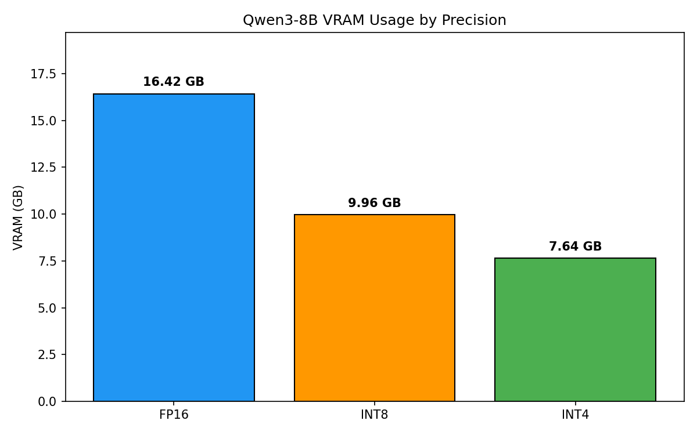
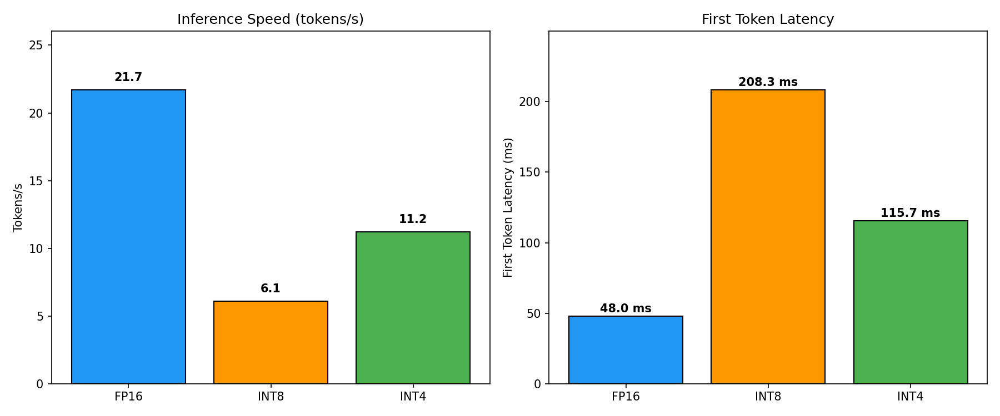
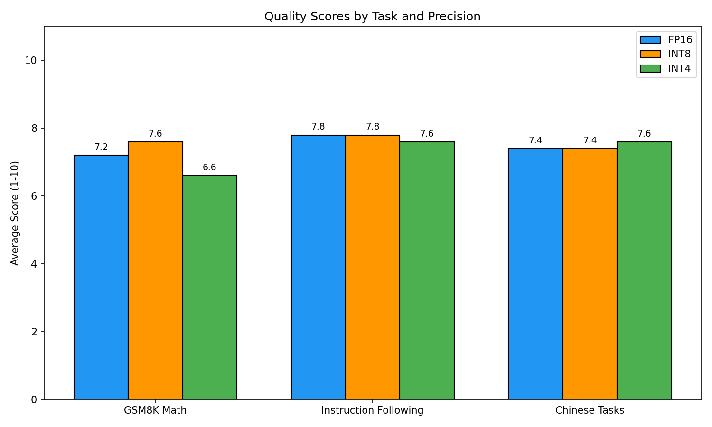
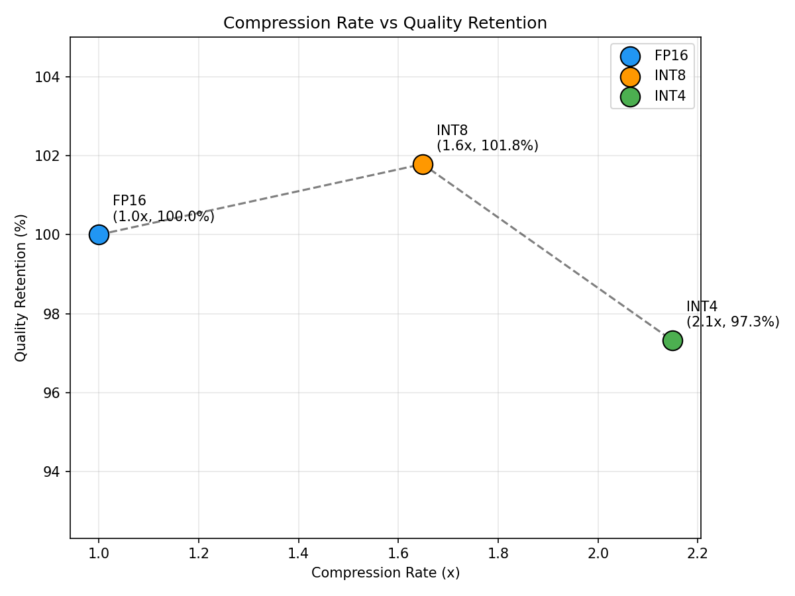
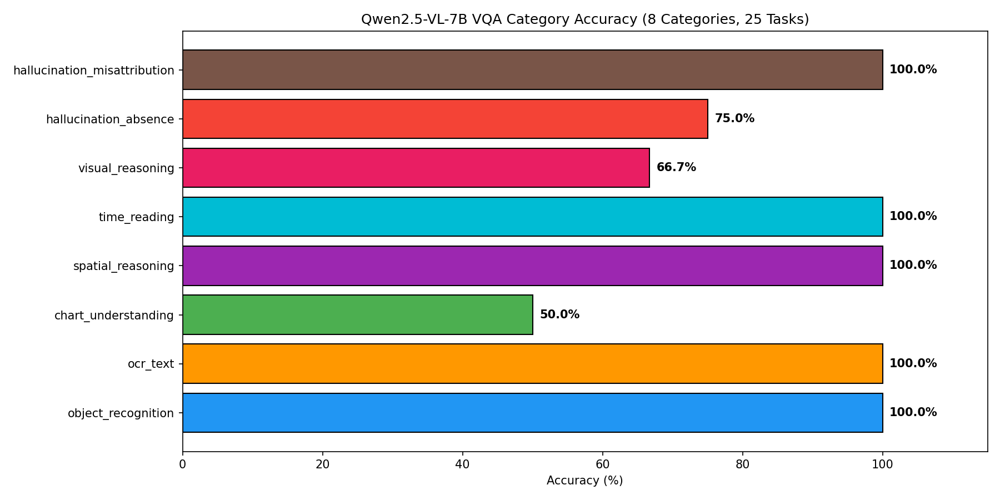
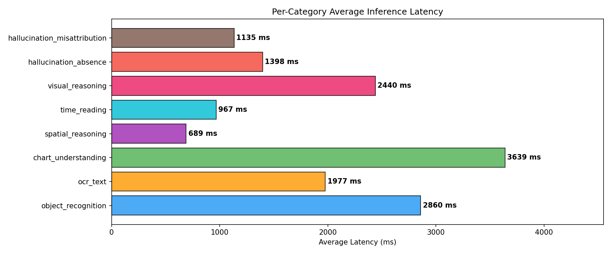
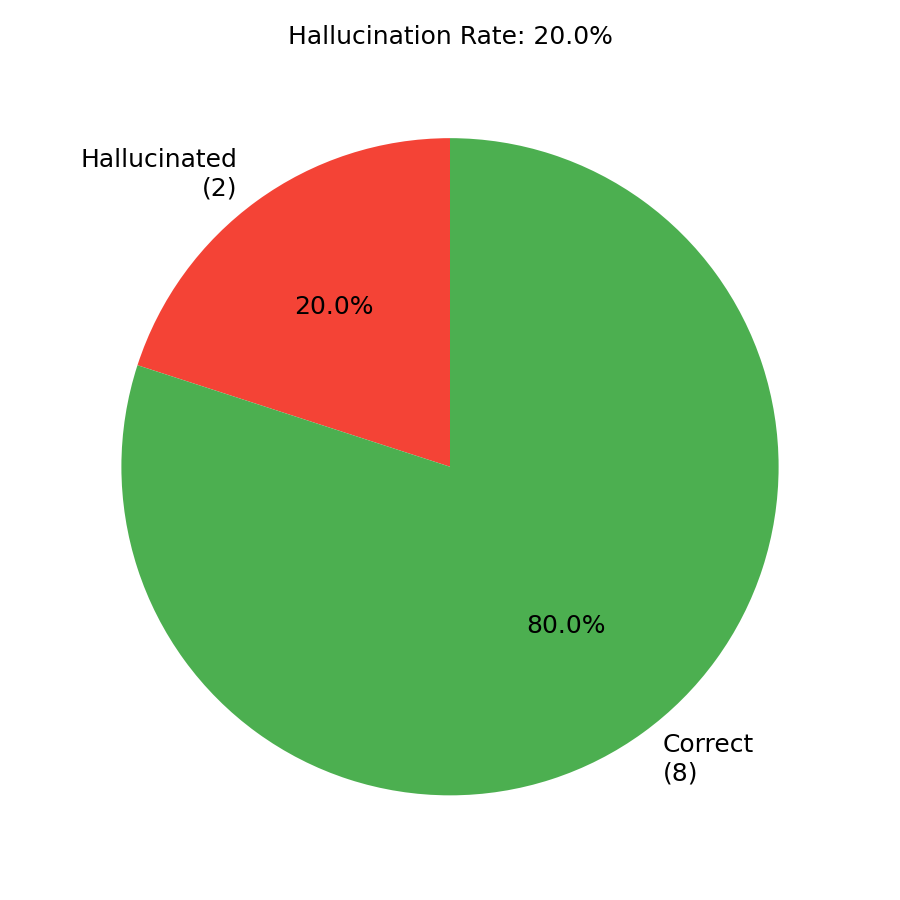

# 第5课 上机实验报告

## 一、量化实验报告（必做）

### 1.1 实验环境

- **模型**: Qwen3-8B (Qwen/Qwen3-8B)
- **GPU**: NVIDIA A100-SXM4-80GB x 4 (GPU 4,5,6,7)
- **框架**: PyTorch + Transformers + BitsAndBytes
- **精度**: FP16 / INT8 (bitsandbytes) / INT4 (NF4 + Double Quant)

### 1.2 三种精度的显存占用对比表

| 精度 | 显存占用 (GB) | 加载时间 (s) | 相对FP16显存比 |
|------|--------------|-------------|---------------|
| FP16 | 16.42 | 13.7 | 1.00x |
| INT8 | 9.96 | 9.7 | 0.61x |
| INT4 | 7.64 | 8.3 | 0.47x |



### 1.3 推理速度对比表

| 精度 | Tokens/s | 首Token延迟 (ms) |
|------|----------|-----------------|
| FP16 | 21.7 | 48.0 |
| INT8 | 6.1 | 208.3 |
| INT4 | 11.2 | 115.7 |



### 1.4 三类任务的质量评分对比表（LLM-as-Judge, 1-10分）

| 任务类型 | FP16 | INT8 | INT4 | INT4质量保持率 |
|---------|------|------|------|--------------|
| GSM8K 数学推理 | 7.2 | 7.6 | 6.6 | 91.7% |
| 指令跟随 | 7.8 | 7.8 | 7.6 | 97.4% |
| 中文任务 | 7.4 | 7.4 | 7.6 | 102.7% |



### 1.5 压缩率 vs 质量保持率



- **FP16**: 压缩率 1.0x, 质量保持 100.0%
- **INT8**: 压缩率 1.6x, 质量保持 101.8%
- **INT4**: 压缩率 2.1x, 质量保持 97.3%

### 1.6 分析：量化对哪类任务影响最大？为什么？

根据实验数据，量化对 **GSM8K 数学推理** 任务影响最大（FP16→INT4 分数下降 0.6 分）。

**分析原因：**

1. **数学推理任务（GSM8K）** 对数值精度高度敏感。量化会导致权重的微小数值偏差，这些偏差在多步推理链中会累积放大，导致最终计算结果出错。即使单步误差很小，经过多步逻辑推理后，错误率会显著上升。

2. **指令跟随任务** 对格式控制要求精确，INT4 量化可能导致模型对特定格式指令的理解出现偏差（如"恰好三个词"、"JSON格式"等精确约束），但一般性的指令跟随能力相对鲁棒。

3. **中文理解/生成任务** 主要依赖语义理解和文本生成能力，这些能力分布在模型的大量参数中，具有较好的冗余性，因此对量化的鲁棒性相对较强。

**总结：** 需要精确数值计算和严格逻辑推理的任务受量化影响最大，而偏向语义理解和开放式生成的任务则具有更好的量化鲁棒性。在实际部署中，如果主要场景是对话和文本生成，INT4 量化是性价比极高的选择；但如果涉及数学推理或代码生成等精确任务，建议至少使用 INT8 精度。
---

## 二、选做实验报告：选项 2 - 迷你多模态实验（增强版）

### 2.1 实验设置

- **模型**: Qwen/Qwen2.5-VL-7B-Instruct
- **参数量**: 8.29B
- **显存占用**: 15.45 GB
- **加载时间**: 6.7s
- **测试图像**: 10 张合成图像（几何形状、数学题、柱状图、场景图、钟表、空间布局、表格、对比面板、会议记录、抽象图案）
- **评估类别**: 8 大类共 25 个测试任务
- **评估维度**: 基础VQA + 空间推理 + OCR + 图表理解 + 视觉推理 + 幻觉检测 + 多轮对话
- **平均推理延迟**: 2072ms

### 2.2 八大类别的准确率对比

| 任务类别 | 正确数 | 总数 | 准确率 | 平均延迟(ms) |
|---------|-------|------|-------|-------------|
| 物体识别与计数 | 3 | 3 | 100.0% | 2860 |
| OCR文字识别 | 3 | 3 | 100.0% | 1977 |
| 图表数据理解 | 1 | 2 | 50.0% | 3639 |
| 空间推理 | 3 | 3 | 100.0% | 689 |
| 时间读取 | 1 | 1 | 100.0% | 967 |
| 对比与视觉推理 | 2 | 3 | 66.7% | 2440 |
| 幻觉检测（缺失物体） | 6 | 8 | 75.0% | 1398 |
| 幻觉检测（错误归因） | 2 | 2 | 100.0% | 1135 |
| **总计** | **21** | **25** | **84.0%** | **2072** |





### 2.3 分类别详细分析

**高准确率类别 (100%)**:
- **物体识别与计数**: 模型能准确识别并列举所有形状及其颜色，精确计数。
- **OCR文字识别**: 能正确读取数学公式、会议记录和表格数据，并提取关键信息。
- **空间推理**: 能准确描述物体相对位置（上下左右、中央等）。
- **时间读取**: 能从钟表图像读取时间（但存在分钟级别误差）。
- **错误归因幻觉检测**: 能正确归因表格中不同人的数据，不混淆。

**中等准确率类别**:
- **对比与视觉推理 (67%)**: 在图案序列推理和多步逻辑计算方面表现较好，但精确计数有时出错。
- **幻觉检测 (75%)**: 多数情况能正确拒绝不存在的物体，但在诱导性问题（如询问秒针）下仍会产生幻觉。

**较低准确率类别**:
- **图表数据理解 (50%)**: 能正确读取单个柱状图数据，但多数值求和计算容易出错。

### 2.4 幻觉率统计

通过两类幻觉测试（缺失物体问询 + 错误归因验证）评估模型幻觉问题：

- **总幻觉测试数**: 10
- **产生幻觉数**: 2
- **幻觉率**: 20.0%



**幻觉分析：**

实验中发现 VLM 在以下场景更容易产生幻觉：
1. **秒针问题**: 钟表图像中没有秒针，但模型在被问及"秒针指向几"时编造了答案，说明模型倾向于"回答问题"而非"质疑前提"。
2. **语言误导**: 当问"图片下方有一行中文说明文字"时，图片中实际只有英文标签，但模型将英文标签翻译成中文来回答，属于过度推理。
3. **缺失物体检测**: 对于明确不存在的物体（汽车、鸟、Panel C、Bob手机号），模型能正确拒绝回答，说明模型在大多数场景下具备基本的诚实性。

### 2.5 多轮视觉对话测试

进行了 3 组多轮对话测试，模拟真实交互场景：

**场景理解多轮对话** (图像: scene)

- **User [1]**: 请描述这张图片中的内容。
- **Assistant**: 这张图片展示了一个简单的卡通风格的风景画。画面中有一座小房子，房子的屋顶是红色的，墙壁是棕色的，窗户是白色的。房子前面有一条蓝色的小路通向远方。房子旁边有一棵树，树干是棕色的，树叶是绿色的。背景中有两座灰色的山峰，天空是浅蓝色的，上面有两朵白色的云朵和一个黄色的太阳。整体画面给人一种宁静、自然的感觉。
- *延迟: 3308ms*

- **User [2]**: 图片中的房子有几层？门和窗户各有几个？
- **Assistant**: 图片中的房子只有一层。门有一个，窗户有两个。
- *延迟: 567ms*

- **User [3]**: 如果我要从房子走到树那里，需要经过河流吗？请根据图片中物体的位置判断。
- **Assistant**: 根据图片中的物体位置，从房子走到树那里不需要经过河流。房子和树之间是一条蓝色的小路，可以直接到达。
- *延迟: 1066ms*

**表格数据多轮分析** (图像: table)

- **User [1]**: 请读出表格中所有人的信息。
- **Assistant**: 表格中有四个人的信息如下：

1. Alice，28岁，北京，得分92。
2. Bob，35岁，上海，得分87。
3. Carol，22岁，广州，得分95。
4. David，41岁，深圳，得分78。
- *延迟: 2163ms*

- **User [2]**: 谁的分数高于90分？
- **Assistant**: 根据表格中的信息，只有Carol的分数高于90分，她的得分为95。
- *延迟: 762ms*

- **User [3]**: 如果按年龄从小到大排序，顺序是什么？
- **Assistant**: 如果按年龄从小到大排序，顺序是：

1. Carol（22岁）
2. Alice（28岁）
3. Bob（35岁）
4. David（41岁）
- *延迟: 1509ms*

**图表数据多轮分析** (图像: barchart)

- **User [1]**: 这个图表展示了什么信息？
- **Assistant**: 这个图表展示了一个公司在2023年1月至6月期间的每月销售单位数量。每个柱子代表一个月，柱子的高度表示该月的销售量（以单位为单位）。具体数据如下：

- 1月 (Jan): 45个单位
- 2月 (Feb): 72个单位
- 3月 (Mar): 58个单位
- 4月 (Apr): 91个单位
- 5月 (May): 65个单位
- 6月 (Jun): 83个单位

从图表中可以看出，4月份的销售量最高，达到了91个单位；而1月份的销售量最低，只有45个单位。其他月份的销售量分别为：2月72个单位、3月58个单位、5月65个单位和6月83个单位。
- *延迟: 6325ms*

- **User [2]**: 哪些月份的销量超过了70？
- **Assistant**: 根据图表中的数据，以下月份的销量超过了70个单位：

- 2月 (Feb): 72个单位
- 4月 (Apr): 91个单位
- 6月 (Jun): 83个单位

因此，有3个月份的销量超过了70个单位。
- *延迟: 2330ms*

- **User [3]**: 你能估算上半年的平均月销量吗？
- **Assistant**: 要估算上半年的平均月销量，我们需要将这六个月的总销量除以6。

已知的数据是：
- 1月 (Jan): 45个单位
- 2月 (Feb): 72个单位
- 3月 (Mar): 58个单位
- 4月 (Apr): 91个单位
- 5月 (May): 65个单位
- 6月 (Jun): 83个单位

首先计算总销量：
\[ 45 + 72 + 58 + 91 + 65 + 83 = 436 \]

然后计算平均月销量：
\[ \text{平均月销量} = \frac{\text{总销量}}{\text{月份数}} = \frac{436}{6} \approx 72.67 \]

所以，上半年的平...
- *延迟: 6809ms*

**多轮对话分析：**
- 模型在多轮交互中能保持上下文一致性，后续回答能正确引用之前对话中建立的信息。
- 表格分析场景中，模型能准确执行排序、筛选等多步数据操作。
- 图表多轮分析中，模型能从概述逐步深入到具体数值查询和聚合计算。

### 2.6 减少幻觉的建议

基于实验观察，提出以下减少 VLM 幻觉的策略：

1. **提示工程**: 在 system prompt 中明确要求"如果无法确认某个信息，请说明无法确认而不是猜测"
2. **RLHF/DPO 对齐**: 在后训练阶段使用包含幻觉惩罚的偏好数据
3. **Chain-of-Thought**: 要求模型先逐步描述图像内容，再回答具体问题
4. **自我验证**: 让模型生成答案后再检查一遍是否与图像一致
5. **更大模型/更好预训练**: 72B 及以上模型的幻觉率显著低于 7B 级别

---

## 三、总结反思

### 3.1 后训练各环节的关系与选择策略

后训练流程可以概括为：**SFT → DPO → GRPO → 量化/蒸馏**，各环节承担不同职责：

| 环节 | 目标 | 输入 | 关键技术 |
|------|------|------|---------|
| **SFT** | 赋予模型指令跟随能力 | 指令-回复对 | Full fine-tuning, LoRA |
| **DPO** | 对齐人类偏好 | 偏好对数据 | 直接偏好优化，无需奖励模型 |
| **GRPO** | 强化特定能力（如推理） | 可验证的任务 | 群组相对策略优化 |
| **量化** | 压缩模型、降低部署成本 | 训练好的模型 | INT8/INT4, NF4 |
| **蒸馏** | 将大模型能力迁移到小模型 | 教师模型 + 数据 | KD, 推理链蒸馏 |

**选择策略：**

1. **SFT 是基础**：几乎所有后训练流程都需要 SFT 作为起点，它决定了模型的基本对话能力。
2. **DPO vs GRPO 的选择**：
   - 如果有高质量偏好数据且目标是通用对齐，选 DPO
   - 如果需要强化特定可验证能力（数学、代码、搜索），选 GRPO
   - 两者可以组合使用：先 DPO 对齐，再 GRPO 增强
3. **量化 vs 蒸馏的选择**：
   - 量化几乎零成本，适合所有部署场景
   - 蒸馏需要额外训练成本，但能实现更大的模型压缩比
4. **流水线组合**：可以先做 GRPO 增强推理能力，再蒸馏到小模型，最后量化部署

### 3.2 实际 LLM 应用项目的技术组合建议

对于一个实际的 LLM 应用项目，我的技术选择策略如下：

**场景 1：通用对话助手**
```
Base Model → SFT（高质量对话数据）→ DPO（人类偏好）→ INT4 量化部署
```
- 重点在 SFT 和 DPO 环节的数据质量
- INT4 量化可大幅降低部署成本，对话质量损失可接受

**场景 2：数学/代码推理助手**
```
Base Model → SFT → GRPO（数学/代码奖励）→ INT8 量化部署
```
- 使用 GRPO 强化推理能力
- 选择 INT8 而非 INT4，因为推理任务对精度更敏感

**场景 3：边缘设备部署**
```
大模型训练好 → 蒸馏到小模型 → INT4 量化 → 部署
```
- 蒸馏+量化组合实现极致压缩
- 适合手机、IoT 等资源受限场景

**场景 4：多模态应用**
```
VLM Base → SFT（多模态数据）→ DPO（幻觉惩罚）→ 量化部署
```
- 多模态对齐重点解决幻觉问题
- DPO 中加入幻觉惩罚的偏好数据

**核心原则：**
1. 数据质量 > 训练技巧 > 模型大小
2. 先保证功能正确，再优化部署效率
3. 量化是"免费午餐"，应默认使用
4. 蒸馏在需要大幅压缩时才考虑
5. 持续评估是关键——每个环节都需要系统化评测
